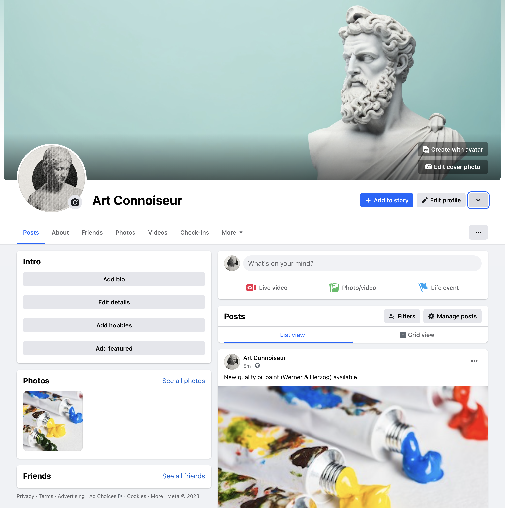

[]

## Table of contents
- [Art Connoisseur Introduction](#django-bakery-introduction)                                        
- [UX](#ux)
  - [User Stories](#user-stories)
  - [Wireframes](#wireframes)
    - [Home](#home)
    - [My Delights](#my-delights)
    - [Add Recipie](#add-recipie)
    - [Login](#login)
    - [Register](#register)

- [Agile Methodology](#agile-methodology)

- [Technologies](#technologies) 
  - [Languages](#languages)
  - [Frameworks, Hosting Services and IDEs](#frameworks-hosting-services-and-ides)

- [Features](#features)

- [Web Marketing](#web-marketing)
  - [Social Media Marketing](#social-media-marketing)
  - [Search Engine Optimization](#search-engine-optimization)

- [Testing, Validation and Performance](#testing-validation-and-performance)

- [Deployment](#deployment)
  - [Elephant SQL](#elephant-sql)
  - [Cloudinary](#cloudinary)
  - [Heroku](#heroku) 
  - [Forking with GitHub](#forking-with-github)
  - [Cloning with GitHub](#cloning-with-github)

- [Credits](#credits)

## Art Connoisseur Introduction
Art Connoisseur is an eCommerce shop that has just established itself with the aim of providing artists and hobbyists alike with a range
of art materials from budget to quality materials. At the moment the offering is small in quantity however growing for each week.
Art Connoisseur also provides information about art related events, workshops, drawing walks or historical trips for the art community.
The live website can be accessed here [Django Bakery](https://django-baker-862762494240.herokuapp.com/).

## UX
### Agile Methodology

[GitHub projectboard](https://github.com/users/sven-cork/projects/11/views/1) was used to implement user stories for Art Connoisseur project. Each user story was provided a label depending of the urgency of implementation: "Must Have", "Should Have", "Could Have" and "Enchancement":

## User Stories
  - As a site user I want to be able to navigate the website effectively.
  - As a site user I want to sign up easily for a registered account.
  - As a site user I can view comments for past events and evaluate the feedback for future events.
  - As a site user I can sign up to Art Connoisseur newsletter to receive updates on new products and events.
  - As a site user I can browse materials on the store based on category.
  - As a site user I can use the social media link for Meta to access Art Connoisseur.
  - As a site user I appreciate a harmonious website design with regards to colour scheme and balance
  - As a registered user I can login and logout of my account to access my shopping bag, previous orders and profile.
  - As a registered user I can remove items in my shopping bag or update the quantity.
  - As a registered user I can add items to the bag and return later to add more items without loosing any existing products.
  - As a registered user I receive an order confirmation upon completing a purchase.
  - As a registered user I can start a purchase from the pop-up notification or from  inside the bag.

## Features

  ### Home Page

  Landing page for Art Connoisseur visitors.
  ___

  

  ### Events Page

  View past events organised by Art Connoisseur. Leave a comment to share your feedback.
  ___

  
  

  ### Follow-us Page

  Subscribe to Art Connoisseur newsletter.
  ___

  

  ### Materials Page

  Browse for art materials and add items to the shopping bag.
  ___
  
  

  ### Login Page

  As a registered user login to an account.
  ___

  

  ### Register Page

  Register for an Art Connoisseur account.
  ___

  

## Web Marketing
Art Connoisser is an eCommerse website specialising in art materials including a selection of high end products.
The web marketing strategy at time of launch or Art Connoisseur encompasses:
- Social media page on Facebook
- Art Connoisseur optimised with SEO techniques
- Newsletter  

### Social Media Marketing
Facebook has a large customer audience and since Art Connoiseur is mainly focused towards individual customers this platform is an effective and affordable tool for marketing purpose.

### Search Engine Optimization 
In order to increase the likelyhood of Art Connoisseur appearing on the first page for a potential customer searching the web for art materials, a keyword research study was carried out and the following long and short tail words were selected for this project:

- Finest quality, Professional grade, High quality, Renowned brands, Pigment rich, High quality paint brushes, High density paperm, High quality canvas with luxurious finish	

## Testing, Validation and Performance

Please refer to helper document [TEST_VALIDATION.md](TEST_VALIDATION.md).

## Technologies

  ### Languages
  - HTML - Hyper Text Markup Language (HTML) for document design display on web servers.
  - CSS - Cascading Style Sheet (css) for styling of documents written in HTML.
  - JavaScript - Scripting language for dynamically control content on a website.
  - Python - General purpose language providing logic to websites created with Django.

  ### Frameworks, Hosting Services and IDEs
  - Django - Python web framework
  - Django Crispy Forms - Python package to style Django forms
  - Git - Tool for source code management
  - GitHub - Cloud based code hosting platform
  - GitPod - Cloud based IDE
  - Heroku - Cloud based platform for deployment of apps
  - ElephantSQL - PostgreSQL database hosting service
  - Cloudinary - Cloud based image and video management solution
  - Gunicorn - Python Web Server WSGI HTTP server
  - Google Fonts - Font source library to import font styles

## Deployment

### Elephant SQL

Elephant SQL was used to host postgres databases and linked with Heroku:

1. Create an Elephant SQL account and login via elephantsql.com.
2. Select 'Create new instance' and choose the free plan 'Tiny Turtle'.
3. Select data center region closest to your geographical location.
4. Select 'Review' and if details are satisfactory select 'Create Instance'.
5. Select the newly created instance and open 'Details' section
6. Copy the postgres URL for this instance for later use with Heroku deployment.

### Cloudinary 

Cloudinary platform was used to host static files and media.

1. To create a Cloudinary account navigate to cloudinary.com.
2. Select 'Sign up for Free' and choose sign up option.
3. Select 'Create Account'.
4. From Cloudinary Dashboard copy 'API Environmental Variable' for later use with Heroku deployment.

### Heroku

Django Bakery was deployed to Heroku as per the below steps:
1. Create a Heroku account and login via id.heroku.com/login.
2. From 'Dashsboard' select 'New' and 'Create new app'.
3. Choose a name for the app and select region (Europe/United States).
4. Select 'Create app'.
5. To apply settings select the "Settings" button.
6. Select "Reveal Config Vars".
7. Add a Key called 'DATABASE_URL' and for the value enter the URL copied from elephantsql.com (Elephant SQL, step: 6.).
8. Add a Key called 'SECRET_KEY' and enter your choise of secret key value.
9. Add a Key called 'CLOUDINARY_URL' and for the value enter the 'API Environmental Variable' copied from cloudinary.com (Cloudinary, step: 4.).
10. Add a key called 'PORT' with a value of '8000'.
11. From the 'Deployment' tab select 'GitHub' in the 'Deployment method' section. Select 'Connect to GitHub' at the bottom of the page.
12. In the search field search for your GitHub repository name.
13. Select 'Connect' to link up with the GitHub repository.
14. Further down the page select deployment method automatic ('Enable Automatic Deploys') or manual ('Deploy branch').

### Forking with GitHub
1. Open [GitHub](https://github.com).
2. Navigate to the intended repository.
3. Select "Fork" in the top rigth corner of the page.
4. Select the owner of the fork repository in the drop menu provided.
5. Select the "Create Fork" button.
6. Your copy of the original repository has been created.

### Cloning with GitHub
1. Open [GitHub](https://github.com).
2. Navigate to the intended repository.
3. Select the "Code" button on the top of the repository page.
4. Select the copy button for one of the three options: "HTTPS", "SSH" or "GitHub CLI".
5. Open Terminal (or command line tool) on your local computer.
6. In Terminal change the current working directory to the directory where the clone will reside.
7. In Terminal type: "git clone" followed by a space. Paste the URL copied in (step 4.).
8. In Terminal press "Enter"/"Return" to create a local copy of the repository on your computer.

## Credits

### Image Credits

  - [Art cover](https://www.freepik.com/free-ai-image/aesthetic-background-with-greek-bust_59772797.htm#query=greek%20statue&position=30&from_view=search&track=ais) image by freepik on freepik

  - [Premium quality brushes](https://www.freepik.com/free-photo/close-up-paint-brushes-white-background_21071417.htm#query=art%20paint%20brush&position=33&from_view=search&track=ais) image by fabrikasimf on freepik

  - [Student quality brushes](https://www.freepik.com/free-photo/top-view-set-paint-brushes_9360759.htm#page=2&query=art%20paint%20brush&position=49&from_view=search&track=ais) image by freepik on freepik

  - [Acrylic Paint - Newton Abbey](https://www.freepik.com/free-photo/metal-tubes-with-paints_3029539.htm#query=oil%20paint%20tubes&position=24&from_view=search&track=ais) image by freepik on freepik

  - [Oil Colour - Werner & Herzeg](https://www.freepik.com/free-photo/tubes-thick-paints_2994413.htm#page=3&query=oil%20paint%20tubes&position=8&from_view=search&track=ais) image by freepik on freepik

  - [Oil Colour - Werner & Herzeg](https://www.freepik.com/free-photo/tubes-thick-paints_2994413.htm#page=3&query=oil%20paint%20tubes&position=8&from_view=search&track=ais) image by freepik on freepik

  - [Canvas - Linen](https://www.freepik.com/free-photo/top-view-artist-props-table_13564480.htm#query=canvas%20art&position=8&from_view=search&track=ais) image by freepik on freepik

  - [Student standard oil - Saucers](https://www.freepik.com/free-photo/top-view-coloured-paint-abstract-painting_9977265.htm#query=oil%20colours&position=9&from_view=search&track=ais) image by freepik on freepik

  - [Canvas - Cotton](https://www.freepik.com/free-photo/artist-props-table_13564499.htm#query=canvas%20art&position=5&from_view=search&track=ais) image by freepik on freepik 

  - [Drawing paper](https://www.freepik.com/free-photo/overhead-view-blank-paper-with-two-colored-pencils-smartphone-wooden-table_3309058.htm#query=drawing%20paper&position=15&from_view=search&track=ais) image by freepik on freepik 

  - [Acrylics & Oil paper](https://www.freepik.com/free-photo/charcoal-stick-with-drawn-paper-black-white-paper-sheet_4371094.htm#query=drawing%20paper&position=19&from_view=search&track=ais) image by freepik on freepik 

  - [Graphite pencils](https://www.freepik.com/free-photo/pencil-isolated-white-background_3778278.htm#query=drawing%20graphite%20pencils&position=7&from_view=search&track=ais) image by lifeforstock on freepik 

  - [Charcoal sticks](https://www.freepik.com/free-photo/artist-s-black-charcoal-stick-with-smudge-drawing-plain-backdrop_4351682.htm#query=drawing%20graphite%20pencils&position=4&from_view=search&track=ais) image by freepik on freepik 

  - [Subtle Turqois](https://www.freepik.com/free-photo/abstract-luxury-gradient-blue-background-smooth-dark-blue-with-black-vignette-studio-banner_26782170.htm#query=subtle%20turqois&position=22&from_view=search&track=ais) image by benzoix on freepik 
  
  