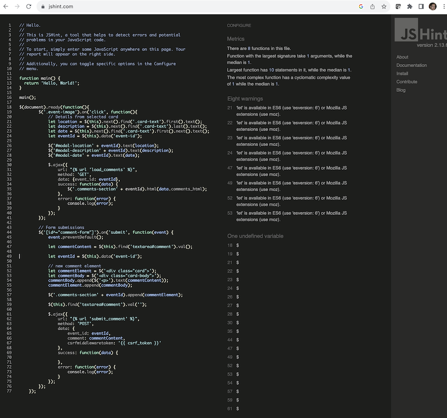

[Go back README.md](README.md)

# Testing, Validation and Performance

## Table of contents

- [Manual Testing](#manual-testing)

- [Device Compatibility](#device-compatibility)

- [Validation and Performance](#validation-and-performance)

- [Bugs](#bugs)

## Manual Testing

  ### Navbar
  ___

  | Action | Expected Behaviour | Pass/Fail |
  |--------|--------------------|-----------|
  | Select "All Materials > All Materials" in Navigation bar | Renders "All Materials" page | Pass |
  | Select "Paints > Pigment Rich Oils" in Navigation bar | Renders "Pigment Rich Oil"s | Pass |
  | Select "Paints > Acrylics" in Navigation bar | Renders "Acrylics" | Pass |
  | Select "Paints > Student Oils" in Navigation bar | Renders "Studend Oils" | Pass |
  | Select "Paints > All Paints" in Navigation bar | Renders "All Paints" | Pass |
  | Select "Canvas > Linen Canvas" in Navigation bar | Renders "Linen Canvas" | Pass |
  | Select "Canvas > Cotton Canvas" in Navigation bar | Renders "Cotton Canvas" | Pass |
  | Select "Canvas > All Canvas" in Navigation bar | Renders "All Canvas" | Pass |
  | Select "Paper > Acrylic & Oil Paper" in Navigation bar | Renders "Acrylic & Oil Paper" | Pass |
  | Select "Paper > Drawing Paper" in Navigation bar | Renders "Drawing Paper" | Pass |
  | Select "Paper > All Paper" in Navigation bar | Renders "All Paper" | Pass |
  | Select "Draw > Graphite Pencils" in Navigation bar | Renders "Graphite Pencils" | Pass |
  | Select "Draw > Coals" in Navigation bar | Renders "Coals" | Pass |
  | Select "Draw > Brushes" in Navigation bar | Renders "Brushes" | Pass |
  | Select "Draw > All Drawing" in Navigation bar | Renders "All Drawing" | Pass |
  | Select "Event" in Navigation bar | Renders "Event" page | Pass |
  | Select "Follow Us" in Navigation bar | Renders "Follow Us" page | Pass |
  | Select "Follow Us" in Navigation bar | Renders "Follow Us" page | Pass |
  | Select "My Account" in Navigation bar | Renders "My Account" drop menu with options | Pass |
  | Select "My Account > Product Management" in Navigation bar | Renders "Manage Materials" page | Pass |
  | Select "My Account > My Profile" in Navigation bar | Renders "My Profile" page | Pass |
  | Select "My Account > Logout in Navigation bar | Renders "Logout" page | Pass |
  | Select bag in Navigation bar | Renders "Bag" page | Pass |

  | Action | Expected Behaviour | Pass/Fail |
  |--------|--------------------|-----------|
  | For any material under: All Materials, Paints, Canvas, Paper or Draw; select "Edit" | Renders "Manage Material" page | Pass |
  | For any material under: All Materials, Paints, Canvas, Paper, Draw; select "Delete" | Removes the material and produces success message | Pass |
  | For any material under: All Materials, Paints, Canvas, Paper, Draw; select thumbnail and "ADD TO BAG" | Adds material to bag | Pass |
  | For any material under: All Materials, Paints, Canvas, Paper, Draw; select thumbnail and adjust quantity | Adjust quantity up or down | Pass |

  | Action | Expected Behaviour | Pass/Fail |
  |--------|--------------------|-----------|
  | In checkout view, add information in all fields, add payment information, select "Complete Order" | Order completes with success message, order "Get 200" success message in IDE Terminal | Pass |

  | Action | Expected Behaviour | Pass/Fail |
  |--------|--------------------|-----------|
  | In Cart view, increase or decrease quantity of material items > Select "Update" | The correct quantity is displayed and updated | Pass |
  | In Cart view, remove an item by selecting "Remove" | The item is removed from the cart | Pass |
  | In Cart view, select "Continue Shopping" | All materials page is rendered | Pass |

  | Action | Expected Behaviour | Pass/Fail |
  |--------|--------------------|-----------|
  | In Event view, select any card thumbnail > opens card modal | Card modal is rendered | Pass |
  | In Event modal window > enter text in "Your Comment" textarea and select "Submit Comment" | The comment is saved to database and rendered in modal window | Pass |

  | Action | Expected Behaviour | Pass/Fail |
  |--------|--------------------|-----------|
  | In Follow Us view, enter email address in "Email Address" field and select "Subscribe" | Confirmation displayed | Pass |
  

## Device Compatibility
  The following Art Connoissery features were tested using Chrome Developer Tools for the devices listed in the table below:
  - Login user
  - Register user
  - Open All Materials
  - Open Events
  - Add Comment to Event,
  - Open Materials
  - Select Material and add to bag
  - Checkout view, update quantity
  - Open Follow-us
  - Subscribe to Newsletter

  | Device | Functionality for the following pages: Home, Materials, Login, Logut, Register, Events, Follow-Us | Screenshot | Pass/Fail |
  |--------|-----------|---------|----|
  | MacBook Pro M1 13"    | All functionality works as expected | []  | Pass |
  | iPad Air | All functionality works as expected | []  | Pass |
  | iPhone 12 Pro | All functionality works as expected | []  | Pass |

  
## Validation and Performance

  ### Lighthouse
  

  
Home Page

   

  - Home Desktop

  []
  ___

  - Home Mobile

  []
  ___

  

  

  
Materials Page

   

  - Materials Desktop

  []
  ___

  - Materials Mobile

  []
  ___

  

  

  
Events Page

   

  - Events Desktop

  []
  ___

  - Events Mobile

  []
  ___

  

  

  
Newsletter Page

   

  - Newsletter Desktop

  []
  ___

  - Newsletter Mobile

  []
  ___

  

  

  
Login Page

   

  - Login Desktop

  []
  ___

  - Login Mobile

  []
  ___

  

  

  
Register Page

   

  - Register Desktop

  []
  ___

  - Register Mobile

  []
  ___

  

### HTML Validation
 HTML validation was carried out using [W3 NU HTML Checker](https://validator.w3.org/nu/) and passed apart from the alert displayed below.
  [] 

### CSS Validation
 CSS validation was carried out using [W3C CSS Validator Checker](https://jigsaw.w3.org/css-validator/). No issues reported.
  []

### JavaScript Validation
 JavaCript validation was carried out using [jshint](https://jshint.com/).
 Alert regarding 'let' variable availability in ES6, no other comments.
  []

### Python Validation
  Python testing was carried out using pep8 in GitPod IDE and [CI Python Linter](https://pep8ci).
  The following alerts were corrected: "no newline at end of file" and "blank line contains whitespace". Apart from this there are only remaining alerts regarding line being too long (>79 character). However I understand this is a preference of style and not an error.
  
  
  ## Bugs
  ___

  - Non registered users placing orders returning error. This was corrected ensuring only registered users having the option to checkout.
  - 'My Profile' page not rendering on mobile views. This was corrected in 'mobile-top'header.html'.
  - Footer area on 'My Profile' page does not take up the full viewport width and further research will be required to resolve this.

 
  